# Huellas de Paz Vault — LLM Maintainer Schema

Read this file at the start of every session. It defines how you (the LLM) maintain this vault.

## Mission

This is a **compounding knowledge base** for the Huellas de Paz project — pet cremation and cemetery software for a Rosario-based client.

- Product/dev lead: **Tomás Pinolini**
- Tech lead: **Franco Zancocchia**
- Client: Huellas de Paz team (name TBD in vault once confirmed)

You maintain the vault. Tomás curates sources, asks questions, and reviews your synthesis. **You never ask Tomás to write wiki pages.** If he asks you to "save this as a note," you do the writing.

The code and shipped docs live in the repo: `d:\HuellasDePaz\HuellasDePaz\`. That repo is **read-only reference** — never modify anything in it directly from this vault.

## Three layers

| Layer | Directory | Your permission |
|-------|-----------|-----------------|
| **Raw sources** | `raw/` | Read-only. Never modify. Never delete. |
| **Wiki synthesis** | `wiki/` | Full write access. You own it. |
| **Meta** | `CLAUDE.md`, `index.md`, `log.md`, `overview.md` | Read/write per rules below. |

If a source changes, **ingest a new snapshot under a new filename** — never overwrite an existing `raw/` file.

## Page conventions

### Frontmatter (required on every `wiki/` page)

```yaml
---
title: Page Title
type: person | feature | decision | gap | version | integration | security | flow | diagram
status: draft | active | stale | archived
tags: []
sources: []
updated: YYYY-MM-DD
---
```

### Naming

- Kebab-case, descriptive: `wiki/features/portal-cliente.md`, `wiki/people/franco-zancocchia.md`.
- Decision pages date-prefixed: `wiki/decisions/2026-04-2fa-email-otp.md`.
- `raw/` files: `YYYY-MM-DD-<topic>.md`.
- Dates always ISO (`YYYY-MM-DD`).

### Atomicity

One concept per page. If a page spans three distinct ideas, split it. Err toward smaller pages with more links — the graph is the navigation.

### Cross-references

- Internal links: `[[wiki/features/portal-cliente]]` (Obsidian wikilinks).
- Citations to raw sources: inline with path: `([raw/meetings/2026-04-30-demo.md](raw/meetings/2026-04-30-demo.md))`.
- **Never restate content verbatim from repo docs.** Synthesize and cite.

### Diagrams

Use **PlantUML** blocks for architecture diagrams:

```plantuml
@startuml
skinparam style strictuml
skinparam monochrome true
...
@enduml
```



### Language

- Wiki prose: **English** (dev-facing, matches project convention).
- Argentine-specific terms keep Spanish even in English prose: *cuota*, *convenio*, *servicio*, *plan de previsión*, *memorial*, *lead*.

## Operations

### Ingest

When Tomás adds a new source:

1. Read the full source. Do not skim.
2. Report 3–6 key takeaways in chat. Do not write files yet.
3. After Tomás confirms, write the ingest:
   - Create or update relevant `wiki/` pages.
   - If standalone-worthy, create a `wiki/source-summaries/` page.
4. Update `index.md` — add new pages, mark updated ones with today's date.
5. Append to `log.md`:
   ```
   ## [YYYY-MM-DD] ingest | <raw source path> | <one-line description>
   Touched: [[wiki/page-1]], [[wiki/page-2]], ...
   ```

### Query

1. Read `index.md` first to orient.
2. Drill into relevant wiki pages.
3. Synthesize the answer with citations.
4. Ask if the answer should be filed back as a new wiki page. If yes, save and update `index.md` + `log.md`.

## Domain glossary

- **Lead** — prospective client captured via cotizador, landing, convenio, or direct entry.
- **Servicio** — individual cremation/burial service with a 5-state lifecycle.
- **Plan de previsión** — prepaid monthly plan with graduated coverage (0%/50%/100%).
- **Convenio** — B2B agreement with a vet clinic, petshop, or refuge.
- **Memorial** — digital tribute page for a deceased pet (public or private).
- **Cotizador** — online price calculator embedded as an iframe.
- **Portal cliente** — client self-service portal accessed via tokenPortal in URL.
- **Portal convenios** — B2B partner portal for vets/petshops to submit leads.
- **MFA / OTP** — two-factor authentication via emailed 6-digit code.
- **Ravenna** — the dev team (Tomás Pinolini + Franco Zancocchia).

## People seed

- **Franco Zancocchia** — tech lead; implements CRM, portals, landing, cotizador. See [[wiki/people/franco-zancocchia]].
- **Tomás Pinolini** — product/dev lead, vault curator. See [[wiki/people/tomas-pinolini]].

## Don't

- Don't restate repo docs verbatim in the wiki. Cite and synthesize.
- Don't ingest the same source twice — check `log.md` first.
- Don't delete raw files. Ever.
- Don't rewrite `CLAUDE.md` without explicit request from Tomás.
- Don't ask Tomás to write wiki pages.
- Don't let `index.md` fall behind — update it on every ingest.