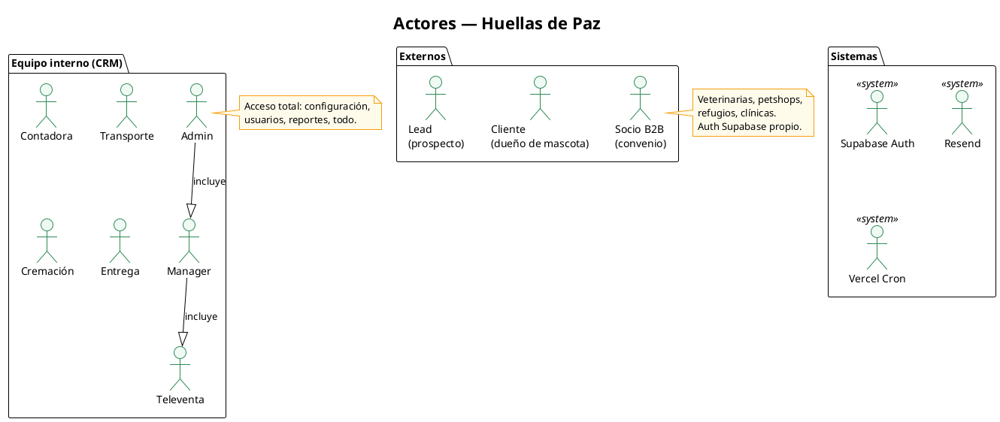

# Actores del sistema

```plantuml
@startuml actores
!theme plain
skinparam ActorBorderColor #2d8a54
skinparam ActorBackgroundColor #f0faf5
skinparam NoteBackgroundColor #fffbeb
skinparam NoteBorderColor #f59e0b

title Actores — Huellas de Paz

' ── Actores internos ──────────────────────────────────────
package "Equipo interno (CRM)" {
  actor "Admin" as admin
  actor "Manager" as manager
  actor "Contadora" as contadora
  actor "Televenta" as televenta
  actor "Transporte" as transporte
  actor "Cremación" as cremacion
  actor "Entrega" as entrega
}

' ── Actores externos ──────────────────────────────────────
package "Externos" {
  actor "Cliente\n(dueño de mascota)" as cliente
  actor "Socio B2B\n(convenio)" as convenio
  actor "Lead\n(prospecto)" as lead
}

' ── Sistemas externos ─────────────────────────────────────
package "Sistemas" {
  actor "Supabase Auth" as supabase <<system>>
  actor "Resend" as resend <<system>>
  actor "Vercel Cron" as cron <<system>>
}

' ── Herencias de rol ──────────────────────────────────────
admin --|> manager : incluye
manager --|> televenta : incluye

note right of admin
  Acceso total: configuración,
  usuarios, reportes, todo.
end note

note right of convenio
  Veterinarias, petshops,
  refugios, clínicas.
  Auth Supabase propio.
end note

@enduml
```