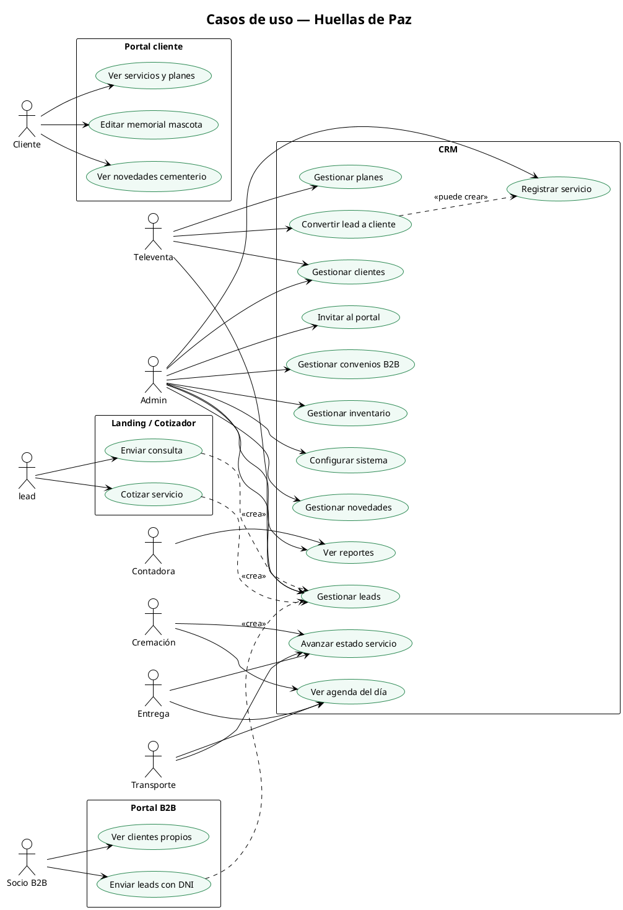

# Casos de uso

```plantuml
@startuml casos-de-uso
!theme plain
skinparam UsecaseBorderColor #2d8a54
skinparam UsecaseBackgroundColor #f0faf5

title Casos de uso — Huellas de Paz

left to right direction

actor "Televenta" as tv
actor "Admin" as admin
actor "Transporte" as transp
actor "Cremación" as crem
actor "Entrega" as entrega
actor "Cliente" as cliente
actor "Socio B2B" as b2b
actor "Contadora" as cont

rectangle "CRM" {
  usecase "Gestionar leads" as UC1
  usecase "Convertir lead a cliente" as UC2
  usecase "Gestionar clientes" as UC3
  usecase "Registrar servicio" as UC4
  usecase "Avanzar estado servicio" as UC5
  usecase "Gestionar planes" as UC6
  usecase "Ver agenda del día" as UC7
  usecase "Gestionar convenios B2B" as UC8
  usecase "Ver reportes" as UC9
  usecase "Gestionar inventario" as UC10
  usecase "Configurar sistema" as UC11
  usecase "Gestionar novedades" as UC12
  usecase "Invitar al portal" as UC13
}

rectangle "Portal cliente" {
  usecase "Ver servicios y planes" as UC14
  usecase "Editar memorial mascota" as UC15
  usecase "Ver novedades cementerio" as UC16
}

rectangle "Portal B2B" {
  usecase "Enviar leads con DNI" as UC17
  usecase "Ver clientes propios" as UC18
}

rectangle "Landing / Cotizador" {
  usecase "Cotizar servicio" as UC19
  usecase "Enviar consulta" as UC20
}

tv --> UC1
tv --> UC2
tv --> UC3
tv --> UC6
admin --> UC1
admin --> UC3
admin --> UC4
admin --> UC8
admin --> UC9
admin --> UC10
admin --> UC11
admin --> UC12
admin --> UC13
transp --> UC7
transp --> UC5
crem --> UC7
crem --> UC5
entrega --> UC7
entrega --> UC5
cont --> UC9
cliente --> UC14
cliente --> UC15
cliente --> UC16
b2b --> UC17
b2b --> UC18
lead --> UC19
lead --> UC20

UC20 ..> UC1 : <<crea>>
UC19 ..> UC1 : <<crea>>
UC17 ..> UC1 : <<crea>>
UC2 ..> UC4 : <<puede crear>>

@enduml
```