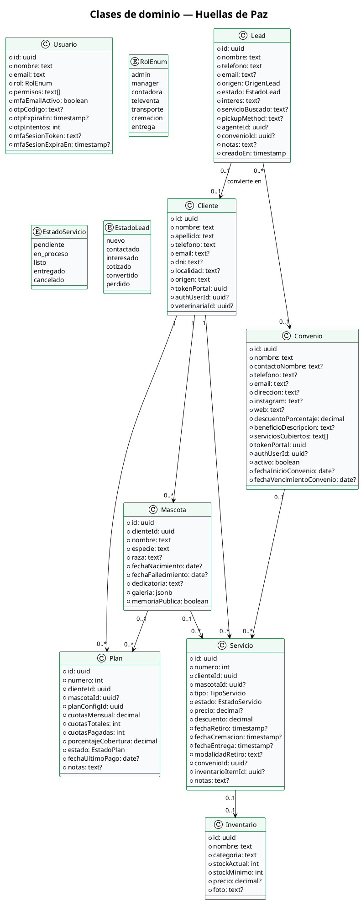

# Clases de dominio

```plantuml
@startuml clases-dominio
!theme plain
skinparam ClassBorderColor #2d8a54
skinparam ClassBackgroundColor #f9fafb
skinparam ClassHeaderBackgroundColor #f0faf5

title Clases de dominio — Huellas de Paz

class Usuario {
  +id: uuid
  +nombre: text
  +email: text
  +rol: RolEnum
  +permisos: text[]
  +mfaEmailActivo: boolean
  +otpCodigo: text?
  +otpExpiraEn: timestamp?
  +otpIntentos: int
  +mfaSesionToken: text?
  +mfaSesionExpiraEn: timestamp?
}

class Cliente {
  +id: uuid
  +nombre: text
  +apellido: text
  +telefono: text
  +email: text?
  +dni: text?
  +localidad: text?
  +origen: text
  +tokenPortal: uuid
  +authUserId: uuid?
  +veterinariaId: uuid?
}

class Mascota {
  +id: uuid
  +clienteId: uuid
  +nombre: text
  +especie: text
  +raza: text?
  +fechaNacimiento: date?
  +fechaFallecimiento: date?
  +dedicatoria: text?
  +galeria: jsonb
  +memoriaPublica: boolean
}

class Servicio {
  +id: uuid
  +numero: int
  +clienteId: uuid
  +mascotaId: uuid?
  +tipo: TipoServicio
  +estado: EstadoServicio
  +precio: decimal?
  +descuento: decimal
  +fechaRetiro: timestamp?
  +fechaCremacion: timestamp?
  +fechaEntrega: timestamp?
  +modalidadRetiro: text?
  +convenioId: uuid?
  +inventarioItemId: uuid?
  +notas: text?
}

class Plan {
  +id: uuid
  +numero: int
  +clienteId: uuid
  +mascotaId: uuid?
  +planConfigId: uuid
  +cuotasMensual: decimal
  +cuotasTotales: int
  +cuotasPagadas: int
  +porcentajeCobertura: decimal
  +estado: EstadoPlan
  +fechaUltimoPago: date?
  +notas: text?
}

class Lead {
  +id: uuid
  +nombre: text
  +telefono: text
  +email: text?
  +origen: OrigenLead
  +estado: EstadoLead
  +interes: text?
  +servicioBuscado: text?
  +pickupMethod: text?
  +agenteId: uuid?
  +convenioId: uuid?
  +notas: text?
  +creadoEn: timestamp
}

class Convenio {
  +id: uuid
  +nombre: text
  +contactoNombre: text?
  +telefono: text?
  +email: text?
  +direccion: text?
  +instagram: text?
  +web: text?
  +descuentoPorcentaje: decimal
  +beneficioDescripcion: text?
  +serviciosCubiertos: text[]
  +tokenPortal: uuid
  +authUserId: uuid?
  +activo: boolean
  +fechaInicioConvenio: date?
  +fechaVencimientoConvenio: date?
}

class Inventario {
  +id: uuid
  +nombre: text
  +categoria: text
  +stockActual: int
  +stockMinimo: int
  +precio: decimal?
  +foto: text?
}

enum RolEnum {
  admin
  manager
  contadora
  televenta
  transporte
  cremacion
  entrega
}

enum EstadoServicio {
  pendiente
  en_proceso
  listo
  entregado
  cancelado
}

enum EstadoLead {
  nuevo
  contactado
  interesado
  cotizado
  convertido
  perdido
}

Cliente "1" --> "0..*" Mascota
Cliente "1" --> "0..*" Servicio
Cliente "1" --> "0..*" Plan
Mascota "0..1" --> "0..*" Servicio
Mascota "0..1" --> "0..*" Plan
Lead "0..1" --> "0..1" Cliente : convierte en
Lead "0..*" --> "0..1" Convenio
Convenio "0..1" --> "0..*" Servicio
Servicio "0..1" --> "0..1" Inventario

@enduml
```