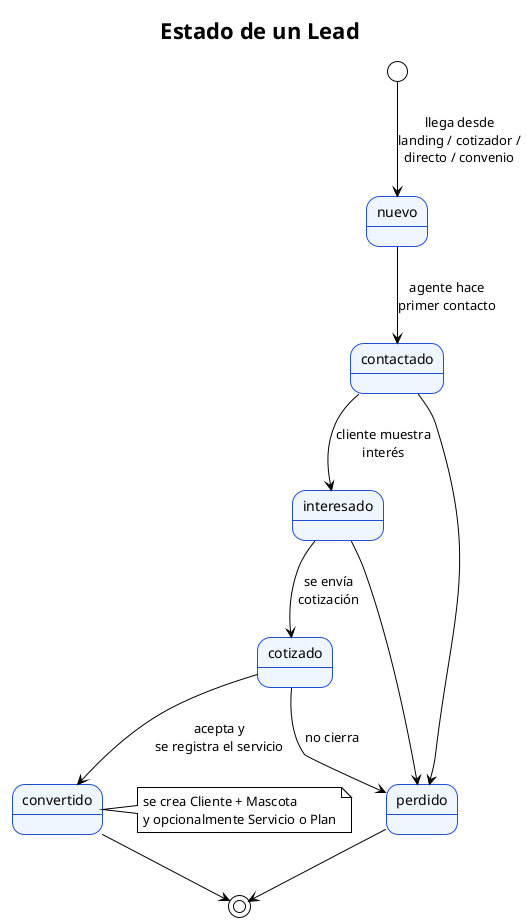

# Estado de un Lead

```plantuml
@startuml estado-lead
!theme plain
skinparam StateBorderColor #1d4ed8
skinparam StateBackgroundColor #eff6ff

title Estado de un Lead

[*] --> nuevo : llega desde\nlanding / cotizador /\ndirecto / convenio

nuevo --> contactado : agente hace\nprimer contacto
contactado --> interesado : cliente muestra\ninterés
interesado --> cotizado : se envía\ncotización
cotizado --> convertido : acepta y\nse registra el servicio
cotizado --> perdido : no cierra

contactado --> perdido
interesado --> perdido

convertido --> [*]
perdido --> [*]

note right of convertido : se crea Cliente + Mascota\ny opcionalmente Servicio o Plan

@enduml
```
