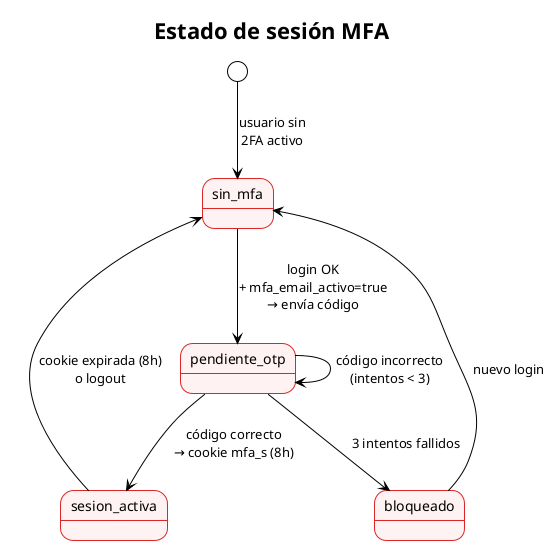

# Estado de sesión MFA

See also: [[wiki/security/2fa-otp]] · [[wiki/features/2fa-otp]]

```plantuml
@startuml estado-mfa
!theme plain
skinparam StateBorderColor #dc2626
skinparam StateBackgroundColor #fef2f2

title Estado de sesión MFA

[*] --> sin_mfa : usuario sin\n2FA activo

sin_mfa --> pendiente_otp : login OK\n+ mfa_email_activo=true\n→ envía código

pendiente_otp --> sesion_activa : código correcto\n→ cookie mfa_s (8h)
pendiente_otp --> pendiente_otp : código incorrecto\n(intentos < 3)
pendiente_otp --> bloqueado : 3 intentos fallidos

sesion_activa --> sin_mfa : cookie expirada (8h)\no logout

bloqueado --> sin_mfa : nuevo login

@enduml
```
