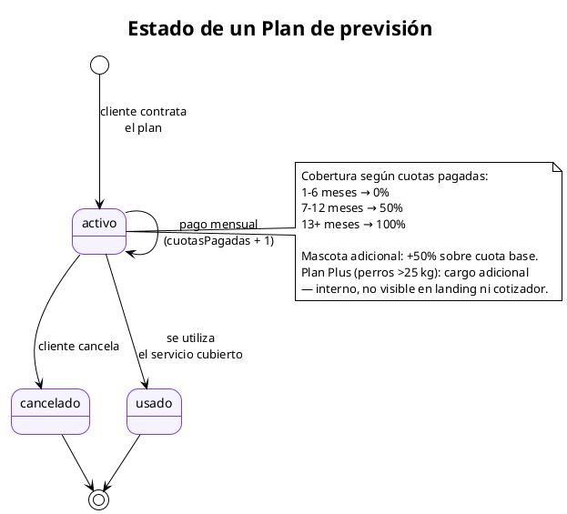

# Estado de un Plan de previsión

```plantuml
@startuml estado-plan
!theme plain
skinparam StateBorderColor #7c3aed
skinparam StateBackgroundColor #f5f3ff

title Estado de un Plan de previsión

[*] --> activo : cliente contrata\nel plan

activo --> activo : pago mensual\n(cuotasPagadas + 1)
activo --> cancelado : cliente cancela
activo --> usado : se utiliza\nel servicio cubierto

note right of activo
  Cobertura según cuotas pagadas:
  1-6 meses → 0%
  7-12 meses → 50%
  13+ meses → 100%

  Mascota adicional: +50% sobre cuota base.
  Plan Plus (perros >25 kg): cargo adicional
  — interno, no visible en landing ni cotizador.
end note

usado --> [*]
cancelado --> [*]

@enduml
```
