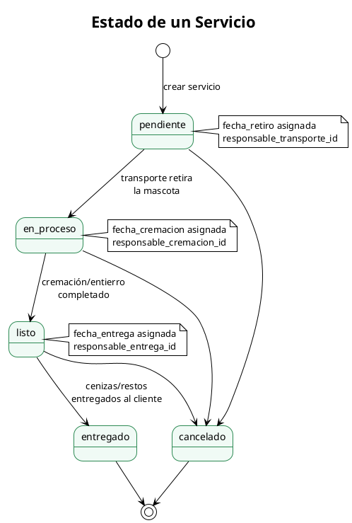

# Estado de un Servicio

```plantuml
@startuml estado-servicio
!theme plain
skinparam StateBorderColor #2d8a54
skinparam StateBackgroundColor #f0faf5

title Estado de un Servicio

[*] --> pendiente : crear servicio

pendiente --> en_proceso : transporte retira\nla mascota
en_proceso --> listo : cremación/entierro\ncompletado
listo --> entregado : cenizas/restos\nentregados al cliente

pendiente --> cancelado
en_proceso --> cancelado
listo --> cancelado

entregado --> [*]
cancelado --> [*]

note right of pendiente : fecha_retiro asignada\nresponsable_transporte_id
note right of en_proceso : fecha_cremacion asignada\nresponsable_cremacion_id
note right of listo : fecha_entrega asignada\nresponsable_entrega_id

@enduml
```
