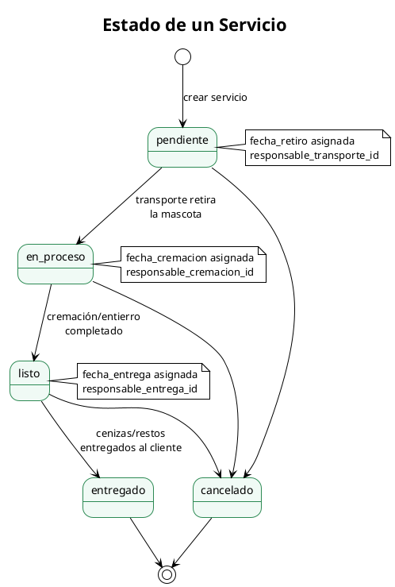
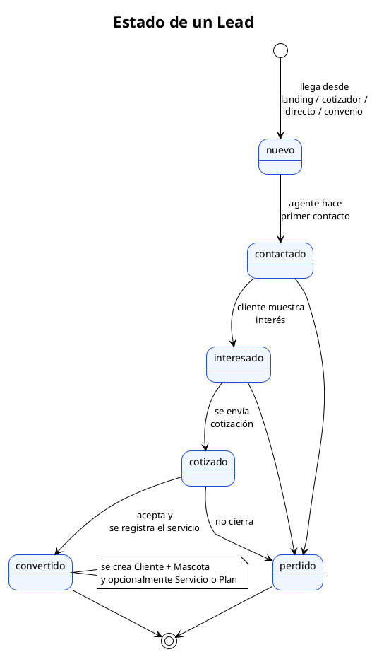
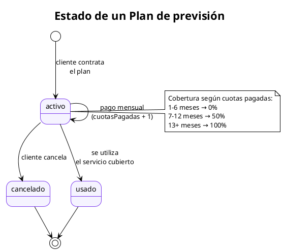
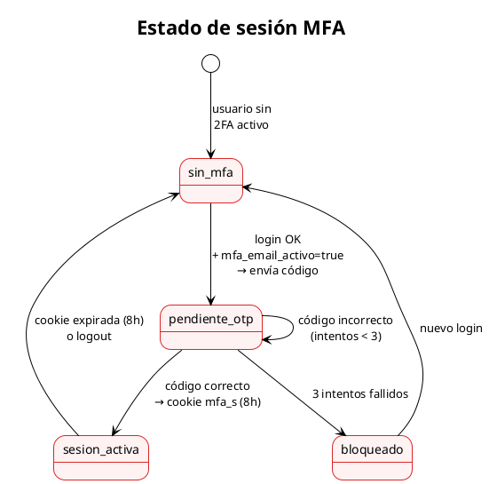

# Diagramas de estado

## Estado de un Servicio

```plantuml
@startuml estado-servicio
!theme plain
skinparam StateBorderColor #2d8a54
skinparam StateBackgroundColor #f0faf5

title Estado de un Servicio

[*] --> pendiente : crear servicio

pendiente --> en_proceso : transporte retira\nla mascota
en_proceso --> listo : cremación/entierro\ncompletado
listo --> entregado : cenizas/restos\nentregados al cliente

pendiente --> cancelado
en_proceso --> cancelado
listo --> cancelado

entregado --> [*]
cancelado --> [*]

note right of pendiente : fecha_retiro asignada\nresponsable_transporte_id
note right of en_proceso : fecha_cremacion asignada\nresponsable_cremacion_id
note right of listo : fecha_entrega asignada\nresponsable_entrega_id

@enduml
```

## Estado de un Lead

```plantuml
@startuml estado-lead
!theme plain
skinparam StateBorderColor #1d4ed8
skinparam StateBackgroundColor #eff6ff

title Estado de un Lead

[*] --> nuevo : llega desde\nlanding / cotizador /\ndirecto / convenio

nuevo --> contactado : agente hace\nprimer contacto
contactado --> interesado : cliente muestra\ninterés
interesado --> cotizado : se envía\ncotización
cotizado --> convertido : acepta y\nse registra el servicio
cotizado --> perdido : no cierra

contactado --> perdido
interesado --> perdido

convertido --> [*]
perdido --> [*]

note right of convertido : se crea Cliente + Mascota\ny opcionalmente Servicio o Plan

@enduml
```

## Estado de un Plan de previsión

```plantuml
@startuml estado-plan
!theme plain
skinparam StateBorderColor #7c3aed
skinparam StateBackgroundColor #f5f3ff

title Estado de un Plan de previsión

[*] --> activo : cliente contrata\nel plan

activo --> activo : pago mensual\n(cuotasPagadas + 1)
activo --> cancelado : cliente cancela
activo --> usado : se utiliza\nel servicio cubierto

note right of activo
  Cobertura según cuotas pagadas:
  1-6 meses → 0%
  7-12 meses → 50%
  13+ meses → 100%
end note

usado --> [*]
cancelado --> [*]

@enduml
```

## Sesión MFA

```plantuml
@startuml estado-mfa
!theme plain
skinparam StateBorderColor #dc2626
skinparam StateBackgroundColor #fef2f2

title Estado de sesión MFA

[*] --> sin_mfa : usuario sin\n2FA activo

sin_mfa --> pendiente_otp : login OK\n+ mfa_email_activo=true\n→ envía código

pendiente_otp --> sesion_activa : código correcto\n→ cookie mfa_s (8h)
pendiente_otp --> pendiente_otp : código incorrecto\n(intentos < 3)
pendiente_otp --> bloqueado : 3 intentos fallidos

sesion_activa --> sin_mfa : cookie expirada (8h)\no logout

bloqueado --> sin_mfa : nuevo login

@enduml
```