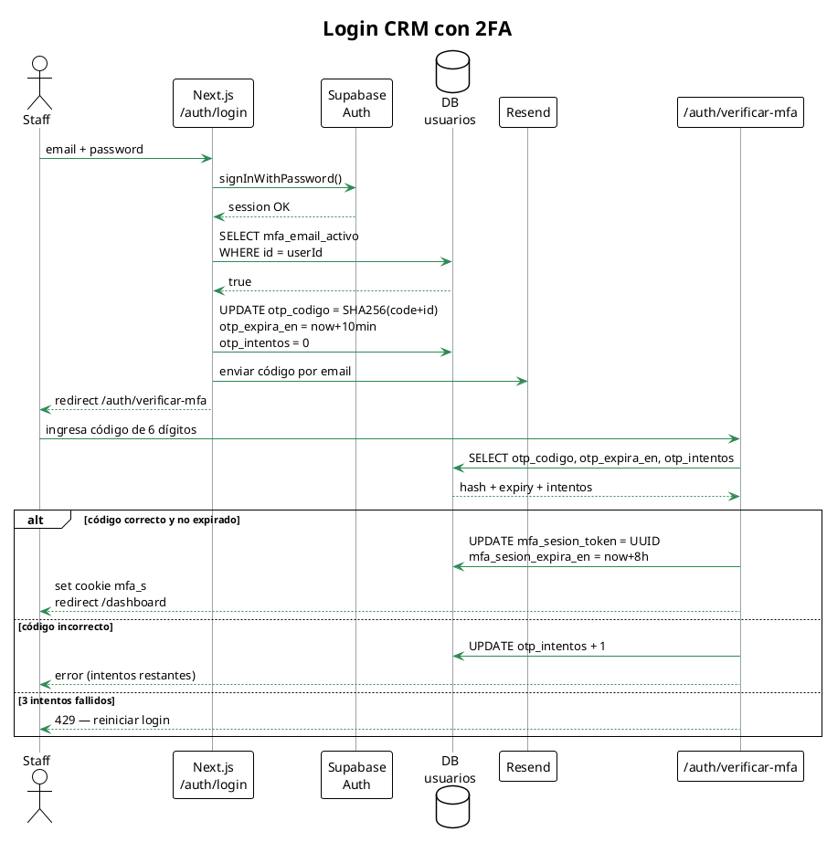
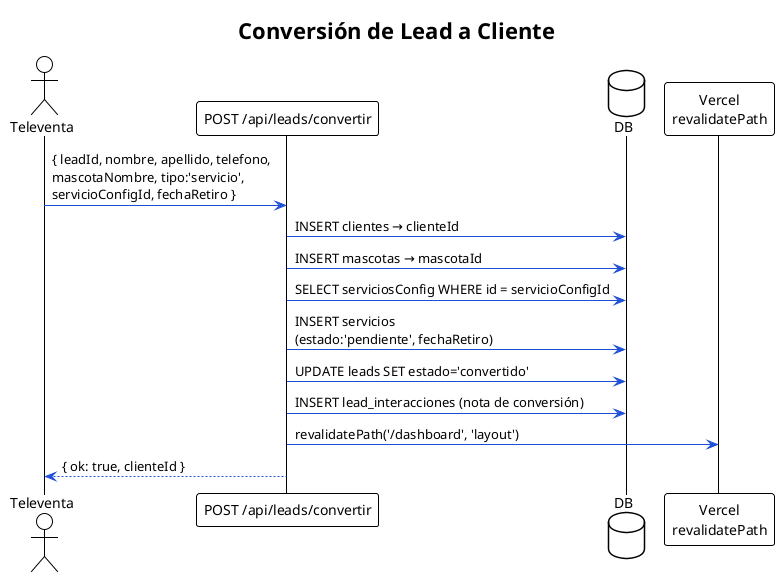
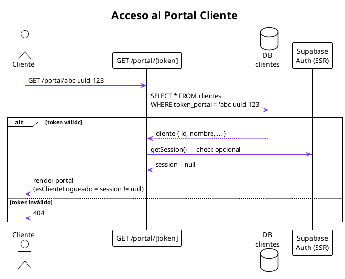
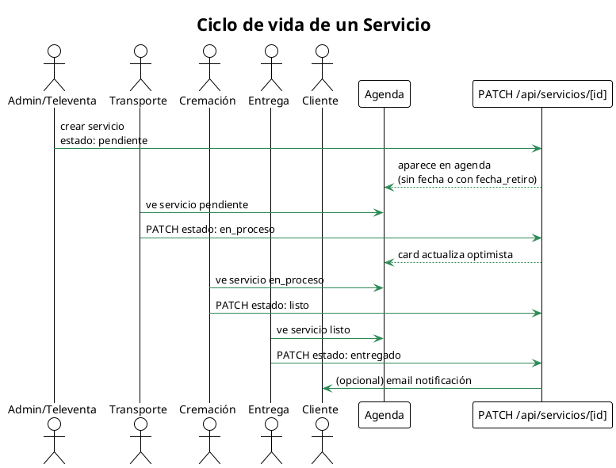

# Diagramas de secuencia

## Login CRM con 2FA

```plantuml
@startuml seq-login-2fa
!theme plain
skinparam SequenceArrowColor #2d8a54
skinparam SequenceLifeLineBorderColor #9ca3af

title Login CRM con 2FA

actor "Staff" as user
participant "Next.js\n/auth/login" as login
participant "Supabase\nAuth" as supa
database "DB\nusuarios" as db
participant "Resend" as resend
participant "/auth/verificar-mfa" as mfa

user -> login : email + password
login -> supa : signInWithPassword()
supa --> login : session OK

login -> db : SELECT mfa_email_activo\nWHERE id = userId
db --> login : true

login -> db : UPDATE otp_codigo = SHA256(code+id)\notp_expira_en = now+10min\notp_intentos = 0
login -> resend : enviar código por email
login --> user : redirect /auth/verificar-mfa

user -> mfa : ingresa código de 6 dígitos
mfa -> db : SELECT otp_codigo, otp_expira_en, otp_intentos
db --> mfa : hash + expiry + intentos

alt código correcto y no expirado
  mfa -> db : UPDATE mfa_sesion_token = UUID\nmfa_sesion_expira_en = now+8h
  mfa --> user : set cookie mfa_s\nredirect /dashboard
else código incorrecto
  mfa -> db : UPDATE otp_intentos + 1
  mfa --> user : error (intentos restantes)
else 3 intentos fallidos
  mfa --> user : 429 — reiniciar login
end

@enduml
```

## Conversión de Lead a Cliente

```plantuml
@startuml seq-convertir-lead
!theme plain
skinparam SequenceArrowColor #1d4ed8

title Conversión de Lead a Cliente

actor "Televenta" as tv
participant "POST /api/leads/convertir" as api
database "DB" as db
participant "Vercel\nrevalidatePath" as cache

tv -> api : { leadId, nombre, apellido, telefono,\nmascotaNombre, tipo:'servicio',\nservicioConfigId, fechaRetiro }

api -> db : INSERT clientes → clienteId
api -> db : INSERT mascotas → mascotaId
api -> db : SELECT serviciosConfig WHERE id = servicioConfigId
api -> db : INSERT servicios\n(estado:'pendiente', fechaRetiro)
api -> db : UPDATE leads SET estado='convertido'
api -> db : INSERT lead_interacciones (nota de conversión)
api -> cache : revalidatePath('/dashboard', 'layout')
api --> tv : { ok: true, clienteId }

@enduml
```

## Acceso al Portal Cliente

```plantuml
@startuml seq-portal-cliente
!theme plain
skinparam SequenceArrowColor #7c3aed

title Acceso al Portal Cliente

actor "Cliente" as cliente
participant "GET /portal/[token]" as portal
database "DB\nclientes" as db
participant "Supabase\nAuth (SSR)" as supa

cliente -> portal : GET /portal/abc-uuid-123

portal -> db : SELECT * FROM clientes\nWHERE token_portal = 'abc-uuid-123'

alt token válido
  db --> portal : cliente { id, nombre, ... }
  portal -> supa : getSession() — check opcional
  supa --> portal : session | null

  portal --> cliente : render portal\n(esClienteLogueado = session != null)
else token inválido
  portal --> cliente : 404
end

@enduml
```

## Flujo de Servicio (ciclo completo)

```plantuml
@startuml seq-servicio
!theme plain
skinparam SequenceArrowColor #2d8a54

title Ciclo de vida de un Servicio

actor "Admin/Televenta" as admin
actor "Transporte" as transp
actor "Cremación" as crem
actor "Entrega" as entrega
actor "Cliente" as cliente
participant "Agenda" as agenda
participant "PATCH /api/servicios/[id]" as api

admin -> api : crear servicio\nestado: pendiente
api --> agenda : aparece en agenda\n(sin fecha o con fecha_retiro)

transp -> agenda : ve servicio pendiente
transp -> api : PATCH estado: en_proceso
api --> agenda : card actualiza optimista

crem -> agenda : ve servicio en_proceso
crem -> api : PATCH estado: listo

entrega -> agenda : ve servicio listo
entrega -> api : PATCH estado: entregado
api -> cliente : (opcional) email notificación

@enduml
```