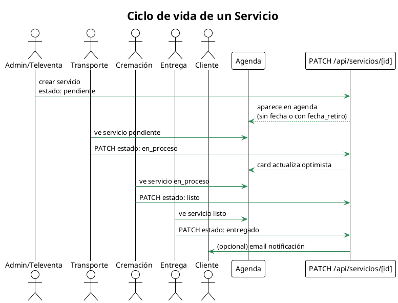

# Ciclo de vida de un Servicio

See also: [[04-estado-servicio]]

```plantuml
@startuml seq-servicio
!theme plain
skinparam SequenceArrowColor #2d8a54

title Ciclo de vida de un Servicio

actor "Admin/Televenta" as admin
actor "Transporte" as transp
actor "Cremación" as crem
actor "Entrega" as entrega
actor "Cliente" as cliente
participant "Agenda" as agenda
participant "PATCH /api/servicios/[id]" as api

admin -> api : crear servicio\nestado: pendiente
api --> agenda : aparece en agenda\n(sin fecha o con fecha_retiro)

transp -> agenda : ve servicio pendiente
transp -> api : PATCH estado: en_proceso
api --> agenda : card actualiza optimista

crem -> agenda : ve servicio en_proceso
crem -> api : PATCH estado: listo

entrega -> agenda : ve servicio listo
entrega -> api : PATCH estado: entregado
api -> cliente : (opcional) email notificación

@enduml
```
