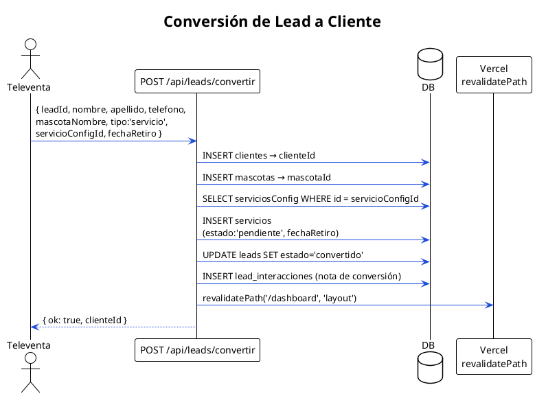

# Conversión de Lead a Cliente

See also: [[wiki/features/leads-kanban]] · [[04-estado-lead]]

```plantuml
@startuml seq-convertir-lead
!theme plain
skinparam SequenceArrowColor #1d4ed8

title Conversión de Lead a Cliente

actor "Televenta" as tv
participant "POST /api/leads/convertir" as api
database "DB" as db
participant "Vercel\nrevalidatePath" as cache

tv -> api : { leadId, nombre, apellido, telefono,\nmascotaNombre, tipo:'servicio',\nservicioConfigId, fechaRetiro }

api -> db : INSERT clientes → clienteId
api -> db : INSERT mascotas → mascotaId
api -> db : SELECT serviciosConfig WHERE id = servicioConfigId
api -> db : INSERT servicios\n(estado:'pendiente', fechaRetiro)
api -> db : UPDATE leads SET estado='convertido'
api -> db : INSERT lead_interacciones (nota de conversión)
api -> cache : revalidatePath('/dashboard', 'layout')
api --> tv : { ok: true, clienteId }

@enduml
```
