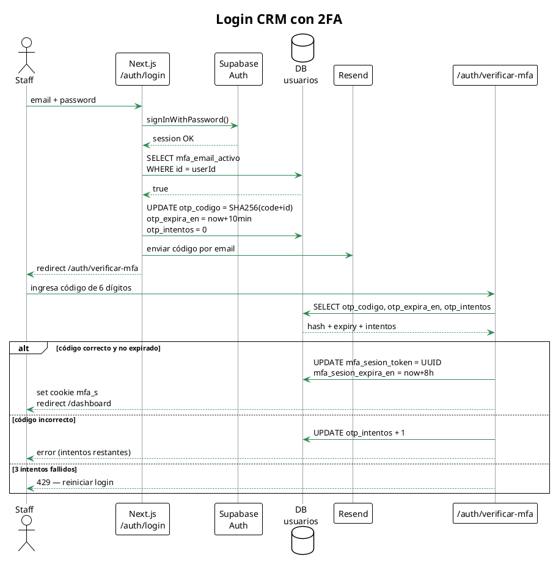

# Login CRM con 2FA

See also: [[wiki/features/2fa-otp]] · [[04-estado-mfa]]

```plantuml
@startuml seq-login-2fa
!theme plain
skinparam SequenceArrowColor #2d8a54
skinparam SequenceLifeLineBorderColor #9ca3af

title Login CRM con 2FA

actor "Staff" as user
participant "Next.js\n/auth/login" as login
participant "Supabase\nAuth" as supa
database "DB\nusuarios" as db
participant "Resend" as resend
participant "/auth/verificar-mfa" as mfa

user -> login : email + password
login -> supa : signInWithPassword()
supa --> login : session OK

login -> db : SELECT mfa_email_activo\nWHERE id = userId
db --> login : true

login -> db : UPDATE otp_codigo = SHA256(code+id)\notp_expira_en = now+10min\notp_intentos = 0
login -> resend : enviar código por email
login --> user : redirect /auth/verificar-mfa

user -> mfa : ingresa código de 6 dígitos
mfa -> db : SELECT otp_codigo, otp_expira_en, otp_intentos
db --> mfa : hash + expiry + intentos

alt código correcto y no expirado
  mfa -> db : UPDATE mfa_sesion_token = UUID\nmfa_sesion_expira_en = now+8h
  mfa --> user : set cookie mfa_s\nredirect /dashboard
else código incorrecto
  mfa -> db : UPDATE otp_intentos + 1
  mfa --> user : error (intentos restantes)
else 3 intentos fallidos
  mfa --> user : 429 — reiniciar login
end

@enduml
```
