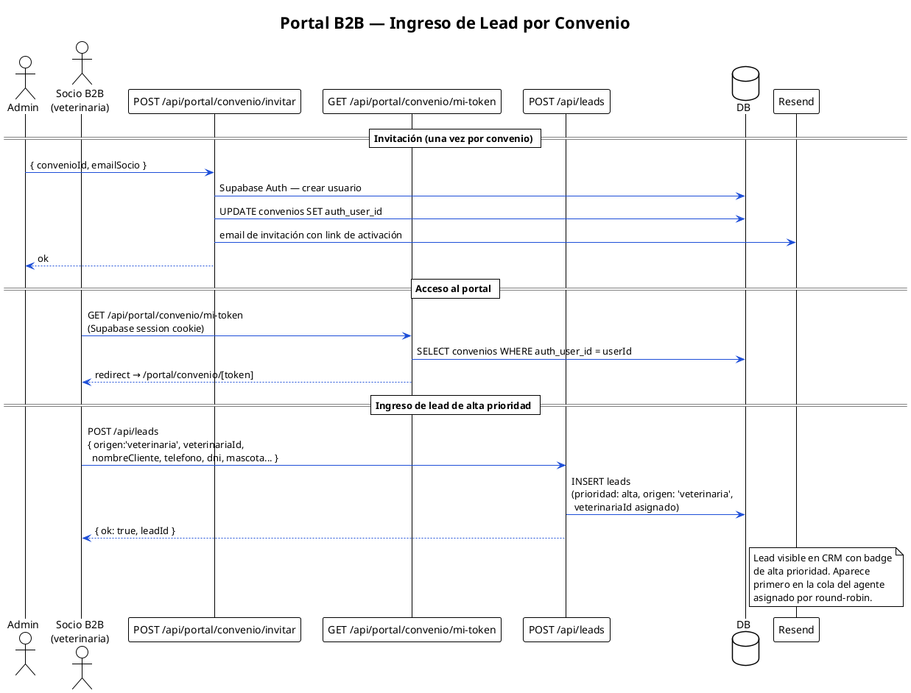

# Portal B2B — Ingreso de Lead por Convenio

See also: [[wiki/features/leads-kanban]] · [[01-actores]]

```plantuml
@startuml seq-portal-b2b
!theme plain
skinparam SequenceArrowColor #1d4ed8

title Portal B2B — Ingreso de Lead por Convenio

actor "Admin" as admin
actor "Socio B2B\n(veterinaria)" as b2b
participant "POST /api/portal/convenio/invitar" as invitar
participant "GET /api/portal/convenio/mi-token" as mitoken
participant "POST /api/leads" as leads
database "DB" as db
participant "Resend" as email

== Invitación (una vez por convenio) ==

admin -> invitar : { convenioId, emailSocio }
invitar -> db : Supabase Auth — crear usuario
invitar -> db : UPDATE convenios SET auth_user_id
invitar -> email : email de invitación con link de activación
invitar --> admin : ok

== Acceso al portal ==

b2b -> mitoken : GET /api/portal/convenio/mi-token\n(Supabase session cookie)
mitoken -> db : SELECT convenios WHERE auth_user_id = userId
mitoken --> b2b : redirect → /portal/convenio/[token]

== Ingreso de lead de alta prioridad ==

b2b -> leads : POST /api/leads\n{ origen:'veterinaria', veterinariaId,\n  nombreCliente, telefono, dni, mascota... }
leads -> db : INSERT leads\n(prioridad: alta, origen: 'veterinaria',\n veterinariaId asignado)
leads --> b2b : { ok: true, leadId }

note right of db
  Lead visible en CRM con badge
  de alta prioridad. Aparece
  primero en la cola del agente
  asignado por round-robin.
end note

@enduml
```
