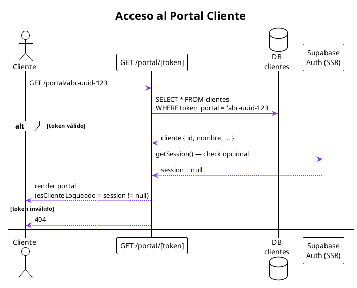

# Acceso al Portal Cliente

See also: [[wiki/features/portal-cliente]]

```plantuml
@startuml seq-portal-cliente
!theme plain
skinparam SequenceArrowColor #7c3aed

title Acceso al Portal Cliente

actor "Cliente" as cliente
participant "GET /portal/[token]" as portal
database "DB\nclientes" as db
participant "Supabase\nAuth (SSR)" as supa

cliente -> portal : GET /portal/abc-uuid-123

portal -> db : SELECT * FROM clientes\nWHERE token_portal = 'abc-uuid-123'

alt token válido
  db --> portal : cliente { id, nombre, ... }
  portal -> supa : getSession() — check opcional
  supa --> portal : session | null

  portal --> cliente : render portal\n(esClienteLogueado = session != null)
else token inválido
  portal --> cliente : 404
end

@enduml
```
