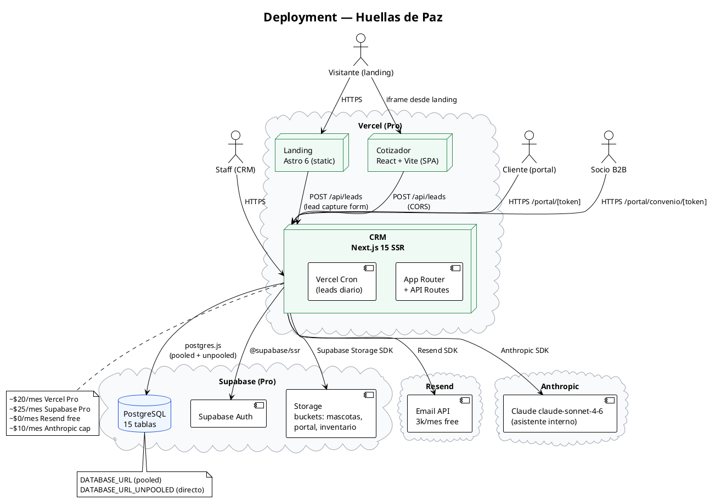

# Diagrama de deployment

```plantuml
@startuml deployment
!theme plain
skinparam NodeBorderColor #2d8a54
skinparam NodeBackgroundColor #f0faf5
skinparam DatabaseBorderColor #1d4ed8
skinparam DatabaseBackgroundColor #eff6ff
skinparam CloudBorderColor #9ca3af
skinparam CloudBackgroundColor #f9fafb

title Deployment — Huellas de Paz

cloud "Vercel (Pro)" {
  node "CRM\nNext.js 15 SSR" as crm {
    component "App Router\n+ API Routes" as app
    component "Vercel Cron\n(leads diario)" as cron
  }
  node "Landing\nAstro 6 (static)" as landing
  node "Cotizador\nReact + Vite (SPA)" as cotizador
}

cloud "Supabase (Pro)" {
  database "PostgreSQL\n15 tablas" as pg
  component "Supabase Auth" as auth
  component "Storage\nbuckets: mascotas,\nportal, inventario" as storage
}

cloud "Resend" {
  component "Email API\n3k/mes free" as email
}

cloud "Anthropic" {
  component "Claude claude-sonnet-4-6\n(asistente interno)" as claude
}

actor "Staff (CRM)" as staff
actor "Cliente (portal)" as cliente
actor "Socio B2B" as b2b
actor "Visitante (landing)" as visitante

staff --> crm : HTTPS
cliente --> crm : HTTPS /portal/[token]
b2b --> crm : HTTPS /portal/convenio/[token]
visitante --> landing : HTTPS
visitante --> cotizador : iframe desde landing

crm --> pg : postgres.js\n(pooled + unpooled)
crm --> auth : @supabase/ssr
crm --> storage : Supabase Storage SDK
crm --> email : Resend SDK
crm --> claude : Anthropic SDK

landing --> crm : POST /api/leads\n(lead capture form)
cotizador --> crm : POST /api/leads\n(CORS)

note bottom of pg
  DATABASE_URL (pooled)
  DATABASE_URL_UNPOOLED (directo)
end note

note bottom of crm
  ~$20/mes Vercel Pro
  ~$25/mes Supabase Pro
  ~$0/mes Resend free
  ~$10/mes Anthropic cap
end note

@enduml
```